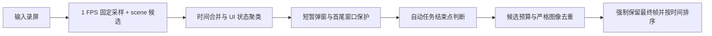
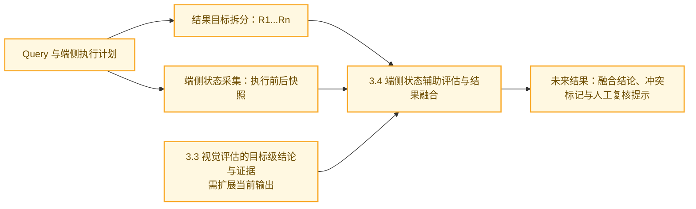

# 操控类自动化评估方案

> **设计与规划稿（2026-09-10 对齐）**：已实现部分按当前仓库描述，3.4 为尚未接入的规划方案。当前任务类评估标准请参阅[任务类（录屏）评估标准](任务类评估标准.md)，并以 `config/skills/operation.yaml` 为唯一规则源。

## 1. 方案目标

针对手机助手操控任务，基于用户 Query、上下文、助手回复和操作录屏，从第三方终端用户视角判断：

* 用户需求是否实际完成；
* 最终状态是否符合预期；
* 操作过程是否存在明显错误；
* 助手回复与实际执行结果是否一致；
* 视觉证据不足时是否应判为无法判断。

当前系统固定使用**单个终端用户视角的视觉裁判**，以录屏视觉信息为主要依据，不依赖被测系统内部日志和执行轨迹。Provider 和模型可以切换，但裁判身份不变。

---

## 2. 总体流程

### 当前已实现流程


```mermaid
flowchart LR
    A["批量操控类 Query 数据集"]
    --> B["3.1 端侧自动化批跑与录屏采集"]
    --> C["Query、上下文、agent 自述、录屏"]
    --> D["3.2 视觉信息预处理：关键帧提取"]
    --> E["3.3 视觉评估<br/>固定单个终端用户 judge"]
    --> F["当前结果：完成判定、维度评分与证据输出"]

    classDef implemented fill:#E8F5E9,stroke:#2E7D32,color:#1B5E20,stroke-width:2px
    class A,B,C,D,E,F implemented
```

图中绿色模块为当前已实现能力。

核心思路是：

> 先明确用户期望达到的结果，再从录屏中提取有效视觉证据，最终判断用户需求是否真正得到满足。

当前已实现链路可由端侧自动化批跑生成录屏，再进入视觉信息预处理和视觉评测；端侧状态采集与状态融合仍处于规划阶段。

人工抽样审核可作为当前 demo 的**系统外离线验证**：用 OK / POK / NOK 标注对照系统结论，评估方案质量、积累后续改进依据。它不属于当前在线评测链路，也不会自动回流或改写在线评测结果。

---

## 3. 核心模块

### 3.1 端侧自动化批跑与录屏采集模块（已实现）

该模块面向操控类 query 的批量数据集：逐条读取 query 和上下文，调用端侧执行自动化能力完成实际操作，并生成后续评测所需的录屏与 agent 自述信息。

```text
批量 query 数据集
→ 端侧执行自动化批跑
→ 录屏 / agent 自述文字回答
→ 交给后续视觉信息预处理与视觉评估
```

预期输出包括：

* 每条 query 对应的操作录屏片段、录屏耗时、端侧自述文字回答等；

端侧状态采集不属于当前模块；它计划在 3.4 中单独接入，用于补足视觉证据。

---

### 3.2 视觉信息预处理模块（已实现）

#### 输入

* 用户操控类Query
* Query对应的录屏文件

#### 输出

* 按时间顺序排列的关键帧；
* 视频时长；
* 关键帧数量；
* 可供视觉模型分析的图片序列。

#### 抽帧算法思路

手机操作录屏通常具有以下特点：

```text
页面长时间静止
→ 用户点击或页面跳转
→ 新页面继续静止
→ 最终结果页面
```

因此，当前使用**固定采样与场景变化相结合的混合抽帧**：


```mermaid
flowchart LR
    A[输入录屏]
    --> B[1 FPS 固定采样 + scene 候选]
    --> C[时间合并与 UI 状态聚类]
    --> D[短暂弹窗与首尾窗口保护]
    --> E[自动任务结束点判断]
    --> F[候选预算与严格图像去重]
    --> G[强制保留最终帧并按时间排序]
```

主要策略包括：

1. 用固定采样覆盖连续过程，用 scene 候选补充两次采样间的快速变化；
2. 合并相邻时间点，并按 UI 状态减少重复画面；
3. 保护短暂 A-B-A 弹窗，以及任务开头 20 秒和结尾 5 秒内每 2 秒的采样；
4. 未显式提供结束时间时自动推断任务结束点；
5. 对清晰图像严格去重，并强制保留视频最终帧。

当前算法版本为 `hybrid-state-v3.1.0`。`max_frames=20` 是普通候选预算；受保护帧为强制项，
因此最终帧数可能超过 20。具体参数和历史回归见[任务类抽帧算法](操作类抽帧算法.md)。

该方法的重点不是完整还原每一次点击，而是尽量覆盖：

* 关键操作过程；
* 页面状态变化；
* 最终结果状态。

---

### 3.3 视觉评估与结果输出模块

#### 输入

* 用户 Query；
* 上下文信息（可选）；
* 助手回复话术（可选）；
* 录屏关键帧；

#### 输出

当前系统使用任务类专用结果结构：

* `correctness`：`ok`、`nok`、`no_support`、`others`；
* `rubric` / `total`：评估维度得分及加权总分；
* `issue_types`：受控问题类型数组，非 `ok` 时首项为决定整体结论的主要根因；
* `is_low_level`：是否属于用户感知明显、可稳定避免的低级问题；
* `rationale`：结论、主要视觉证据，以及有 Agent 回复时的自述与执行结果交叉说明。

#### 评估过程

视觉模型以终端用户视角完成判断：

1. 理解用户目标，并根据关键帧还原操作过程和最终状态；
2. 依据画面证据判断任务是否完成，识别未完成、误操作或异常；
3. 有助手回复时，核验其与实际执行结果是否一致；
4. 输出完成结论、维度评分和理由。

#### 完成状态

| 状态 | 含义 |
|---|---|
| `ok` | 所有生效目标均已闭环，无需用户继续操作 |
| `nok` | 存在影响任务闭环的可归责执行错误 |
| `no_support` | 因真实外部条件、能力限制或必要用户操作无法闭环，且无独立执行错误 |
| `others` | Query 无法一致核验、证据不足/冲突、环境异常等，无法可靠归责 |

对于“打开蓝牙”“开启定位”等状态满足型任务，只要最终状态正确即可判定完成，不强制要求录屏中必须出现状态切换过程。

#### 评估维度设计

当前评估维度包括：

| 维度 | 设计重点 |
|---|---|
| 操作完成度 | 用户要求是否实际得到满足，结果是否完整闭环 |
| 步骤正确性 | 是否存在影响质量的错误、遗漏、冗余、重复或无关步骤 |

步骤正确性不要求操作过程与某一条标准路径完全一致。只要最终结果正确，且过程中没有明显错误，不应因为采用了不同的合法路径而扣分。

#### 结果示例

```json
{
  "task_type": "simple",
  "correctness": "others",
  "rubric": {
    "操作完成度": null,
    "步骤正确性": 4
  },
  "total": null,
  "issue_types": ["未展示可验证结果"],
  "is_low_level": "no",
  "rationale": "录屏显示已进入闹钟编辑页面并设置为 7:00，但未观察到保存后的闹钟列表；助手回复称已设置完成，与画面证据不完全一致。"
}
```

---

### 3.4 端侧状态辅助评估与结果融合模块（规划中）

当前系统尚未接入端侧状态采集和融合。本模块计划用 query 相关对象在执行前、执行后的端侧状态，补足录屏关键帧无法稳定确认的结果；它只对自身实际覆盖的目标提供证据，不对未覆盖目标作推断。

#### 待规划流程


```mermaid
flowchart LR
    A["Query 与端侧执行计划"]
    --> B["结果目标拆分：R1...Rn"]
    A --> C["端侧状态采集：执行前后快照"]
    B --> D["3.4 端侧状态辅助评估与结果融合"]
    C --> D

    E["3.3 视觉评估的目标级结论与证据<br/>需扩展当前输出"]
    --> D
    D --> F["未来结果：融合结论、冲突标记与人工复核提示"]

    classDef planned fill:#FFF8E1,stroke:#F9A825,color:#6D4C00,stroke-width:2px
    class A,B,C,D,E,F planned
```

图中黄色模块为规划中、尚未实现的能力。

#### 输入

* 用户 Query 拆分出的结果目标；
* 每个目标可读取的执行前、执行后端侧状态；
* 端侧状态来源和覆盖范围；
* 改造后的 3.3 视觉评估对同一结果目标给出的结论与证据。

复杂 query 应按用户可验收的结果目标拆分，而不是按点击、跳转等机械操作步骤拆分。例如：

```text
Query：打开蓝牙，关闭免打扰，并设置 4、5、6 点闹钟

R1：蓝牙处于开启状态
R2：免打扰处于关闭状态
R3：存在一个已启用的 04:00 闹钟
R4：存在一个已启用的 05:00 闹钟
R5：存在一个已启用的 06:00 闹钟
```

未来端侧执行计划应产出这些目标，供端侧状态评估和视觉评估共同使用。视觉 judge 可在一次评估中阅读完整录屏，并按 `R1` 至 `R5` 分别输出结论和证据。

当前 3.3 仅输出整题 `correctness`、`rubric` 和自由文本 `rationale`；接入本模块前，需扩展视觉评估输出，使其按结果目标返回结构化结论与证据。

#### 输出

端侧状态评估对每个可覆盖目标输出结构化证据：

```json
{
  "requirement_id": "R1",
  "pre_state": {"bluetooth_enabled": false},
  "post_state": {"bluetooth_enabled": true},
  "expected_value": true,
  "assessment": "satisfied",
  "coverage": "covered",
  "source": "device_settings_api"
}
```

其中 `assessment` 可为：

| 状态 | 含义 |
| --- | --- |
| `satisfied` | 执行后状态满足该目标 |
| `not_satisfied` | 执行后状态明确不满足该目标 |
| `unavailable` | 没有对应的端侧状态获取能力 |
| `unclear` | 状态信息不足或读取异常 |

前后状态的差异可增强“操作实际发生”的证据，但不是任务完成的必要条件。例如蓝牙原本已开启、执行后仍开启时，用户要求“打开蓝牙”仍应判为满足。

#### 融合规则

先对每个结果目标融合视觉与状态证据，再汇总整题结论：

| 视觉结论 | 状态结论 | 融合结果 |
| --- | --- | --- |
| 任意 | `unavailable` | 仅采用视觉结论 |
| `unclear` | `satisfied` / `not_satisfied` | 使用状态结论补足该目标 |
| 明确且一致 | 明确且一致 | 采用一致结论 |
| 明确但相反 | 明确但冲突 | 标记 `evidence_conflict`，该目标为 `unclear`，进入人工复核 |
| `unclear` | `unclear` | 该目标为 `unclear` |

整题汇总规则：

* 所有生效目标均满足：`ok`；
* 任一目标存在影响闭环的可归责错误：`nok`；
* 仅因真实外部条件或必要用户操作不能继续：`no_support`；
* 关键目标证据不足或视觉、状态证据冲突：`others`，并记录相应问题类型。

助手话术继续作为融合判断的一路证据。当 Agent 明确声称已完成、但视频或端侧状态给出相反
证据时，应标记“回复与界面不一致”并判 `nok`；只有回复缺失或无法核验时，才不据此单独扣分。

---

## 4. 当前方案总结

当前操控类评估流程可以概括为：

```text
固定采样 + scene 候选 + 状态去重与保护采样
→ 单个终端用户视觉裁判
→ 完成状态、维度评分和证据输出
```

方案的核心特点是：

* 以黑盒录屏信息为主要观测来源；
* 以用户最终需求是否满足为主要判断标准；
* 不要求匹配固定操作路径；
* 允许输出无法判断，避免在证据不足时强行判定；
* 人工审核仅作为系统外的 demo 方案质量验证手段，不进入正式评估主流程，也不构成自动反馈闭环。

当前主要局限是短暂弹窗、小文字、后台任务等可能无法通过关键帧可靠判断，后续可逐步增加自适应补帧、局部高清观测和端侧状态查询能力。
